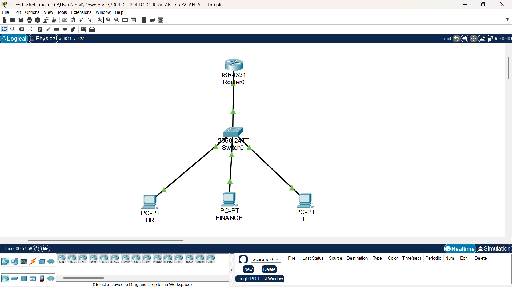

# Secure Multi-VLAN Office Network

Simulasi jaringan kantor menggunakan **Cisco Packet Tracer** dengan implementasi VLAN, 802.1Q trunking, Router-on-a-Stick, inter-VLAN routing, dan Extended ACL untuk mengatur komunikasi antar-departemen.

## Deskripsi Project

Project ini merupakan simulasi jaringan kantor sederhana yang membagi jaringan menjadi tiga departemen:

- HR
- Finance
- IT

Setiap departemen ditempatkan pada VLAN dan subnet yang berbeda untuk memberikan segmentasi jaringan.

Komunikasi antar-VLAN dilakukan menggunakan metode **Router-on-a-Stick**, sedangkan **Extended ACL** digunakan untuk membatasi komunikasi tertentu antar-departemen.

Project ini dibuat sebagai bagian dari portofolio untuk mendemonstrasikan pemahaman dasar mengenai konfigurasi, keamanan, verifikasi, dan troubleshooting jaringan Cisco.

---

## Tujuan

Project ini bertujuan untuk mempraktikkan:

1. Segmentasi jaringan menggunakan VLAN.
2. Konfigurasi access port pada switch.
3. Konfigurasi 802.1Q trunking.
4. Implementasi Router-on-a-Stick.
5. Konfigurasi inter-VLAN routing.
6. Konfigurasi default gateway untuk setiap VLAN.
7. Implementasi Extended ACL.
8. Pengujian konektivitas menggunakan ICMP/Ping.
9. Verifikasi konfigurasi menggunakan Cisco IOS.
10. Troubleshooting konektivitas jaringan.

---

## Topologi Jaringan



Topologi terdiri dari:

- 1 Cisco ISR4300 Series Router
- 1 Cisco Catalyst 2960 Series Switch
- 3 PC yang mewakili departemen:
  - HR
  - Finance
  - IT

Switch terhubung ke router menggunakan satu link trunk 802.1Q.

Link trunk membawa traffic dari VLAN 10, VLAN 20, dan VLAN 30 menuju router.

---

## VLAN & IP Addressing

| Departemen | VLAN |     Network     |    Gateway   |      Host     |
|------------|-----:|-----------------|--------------|---------------|
|     HR     |  10  | 192.168.10.0/24 | 192.168.10.1 | 192.168.10.10 |
|   Finance  |  20  | 192.168.20.0/24 | 192.168.20.1 | 192.168.20.10 |
|     IT     |  30  | 192.168.30.0/24 | 192.168.30.1 | 192.168.30.10 |

Setiap VLAN menggunakan subnet yang berbeda sehingga broadcast domain antar-departemen terpisah.

---

## Switch Configuration

Port switch digunakan sebagai berikut:

|  Port |  Mode  |    VLAN    | Departemen |
|-------|--------|-----------:|------------|
| Fa0/1 | Access |     10     |     HR     |
| Fa0/2 | Access |     20     |   Finance  |
| Fa0/3 | Access |     30     |     IT     |
| Gi0/1 | Trunk  | 10, 20, 30 |   Router   |

Port `Gi0/1` digunakan sebagai trunk untuk membawa traffic dari ketiga VLAN menuju router.

Contoh konfigurasi trunk:

```text
interface GigabitEthernet0/1
 switchport mode trunk
```

Status trunk diverifikasi menggunakan:

```text
show interfaces trunk
```

Hasil verifikasi menunjukkan:

```text
Gig0/1    802.1q    trunking
```

VLAN yang aktif pada trunk:

```text
1,10,20,30
```

---

## Router-on-a-Stick

Router menggunakan satu physical interface dengan beberapa subinterface untuk menangani traffic dari VLAN yang berbeda.

| Subinterface | VLAN |    IP Address   |
|--------------|-----:|-----------------|
|   G0/0/0.10  |  10  | 192.168.10.1/24 |
|   G0/0/0.20  |  20  | 192.168.20.1/24 |
|   G0/0/0.30  |  30  | 192.168.30.1/24 |

Setiap subinterface menggunakan VLAN ID melalui `encapsulation dot1Q` dan IP address sebagai default gateway untuk VLAN masing-masing.

Konfigurasi subinterface:

```text
interface GigabitEthernet0/0/0.10
 encapsulation dot1Q 10
 ip address 192.168.10.1 255.255.255.0

interface GigabitEthernet0/0/0.20
 encapsulation dot1Q 20
 ip address 192.168.20.1 255.255.255.0

interface GigabitEthernet0/0/0.30
 encapsulation dot1Q 30
 ip address 192.168.30.1 255.255.255.0
```

---

## Security Policy

Extended ACL digunakan untuk membatasi komunikasi antar-departemen.

Kebijakan yang diterapkan:

|  Source | Destination |    Action   |
|---------|-------------|-------------|
|    HR   |   Finance   | ❌ Denied  |
|    HR   |      IT     | ✅ Allowed |
| Finance |      HR     | ❌ Denied  |
| Finance |      IT     | ❌ Denied  |

ACL diterapkan secara inbound pada subinterface masing-masing VLAN:

- `G0/0/0.10` → `BLOCK-HR-FINANCE`
- `G0/0/0.20` → `BLOCK-FINANCE`

---

## ACL Configuration

### HR ACL

ACL `BLOCK-HR-FINANCE` digunakan untuk memblokir traffic dari HR menuju Finance dan mengizinkan traffic dari HR menuju IT.

```text
ip access-list extended BLOCK-HR-FINANCE
 deny ip 192.168.10.0 0.0.0.255 192.168.20.0 0.0.0.255
 permit ip 192.168.10.0 0.0.0.255 192.168.30.0 0.0.0.255
```

ACL diterapkan pada subinterface HR:

```text
interface GigabitEthernet0/0/0.10
 ip access-group BLOCK-HR-FINANCE in
```

### Finance ACL

ACL `BLOCK-FINANCE` digunakan untuk memblokir traffic dari Finance menuju HR dan IT.

```text
ip access-list extended BLOCK-FINANCE
 deny ip 192.168.20.0 0.0.0.255 192.168.10.0 0.0.0.255
 deny ip 192.168.20.0 0.0.0.255 192.168.30.0 0.0.0.255
```

ACL diterapkan pada subinterface Finance:

```text
interface GigabitEthernet0/0/0.20
 ip access-group BLOCK-FINANCE in
```

Karena `BLOCK-FINANCE` tidak memiliki explicit `permit` statement, traffic dari Finance yang tidak cocok dengan rule deny juga terkena **implicit deny**.

---

## Testing

### 1. HR → Finance

Pengujian dilakukan dari PC HR:

```text
ping 192.168.20.10
```

Hasil:

```text
Reply from 192.168.10.1: Destination host unreachable.

Packets: Sent = 4, Received = 0, Lost = 4 (100% loss)
```

**Result:** ❌ Traffic dari HR menuju Finance berhasil diblokir oleh ACL.

---

### 2. HR → IT

Pengujian dilakukan dari PC HR:

```text
ping 192.168.30.10
```

Hasil:

```text
Packets: Sent = 4, Received = 4, Lost = 0 (0% loss)
```

**Result:** ✅ Traffic dari HR menuju IT berhasil diteruskan.

---

### 3. Finance → IT

Pengujian dilakukan dari PC Finance:

```text
ping 192.168.30.10
```

Hasil:

```text
Reply from 192.168.20.1: Destination host unreachable.

Packets: Sent = 4, Received = 0, Lost = 4 (100% loss)
```

**Result:** ❌ Traffic dari Finance menuju IT berhasil diblokir oleh ACL.

---

### 4. Finance → HR

Pengujian dilakukan dari PC Finance menggunakan:

```text
ping 192.168.10.10
```

Hasil pengujian:

```text
Reply from 192.168.20.1: Destination host unreachable.

Packets: Sent = 4, Received = 0, Lost = 4 (100% loss)
```

**Result:** ❌ Traffic dari Finance menuju HR berhasil diblokir sesuai dengan konfigurasi `BLOCK-FINANCE`.

---

## Verification

Beberapa perintah Cisco IOS digunakan untuk memverifikasi konfigurasi.

### Verifikasi VLAN

```text
show vlan brief
```

Hasil menunjukkan:

```text
VLAN 10 → Fa0/1
VLAN 20 → Fa0/2
VLAN 30 → Fa0/3
```

### Verifikasi Trunk

```text
show interfaces trunk
```

Trunk:

```text
Gig0/1
Encapsulation: 802.1q
Status: trunking
```

VLAN 10, 20, dan 30 terdeteksi aktif pada trunk.

### Verifikasi Interface Router

```text
show ip interface brief
```

Subinterface yang aktif:

```text
GigabitEthernet0/0/0.10    192.168.10.1    up    up
GigabitEthernet0/0/0.20    192.168.20.1    up    up
GigabitEthernet0/0/0.30    192.168.30.1    up    up
```

### Verifikasi ACL

```text
show access-lists
```

ACL yang dikonfigurasi:

```text
BLOCK-HR-FINANCE
BLOCK-FINANCE
```

---

## Troubleshooting

Selama proses konfigurasi, beberapa hal diperiksa untuk memastikan jaringan berjalan dengan benar.

### Router Interface

Physical interface:

```text
GigabitEthernet0/0/0
```

digunakan sebagai parent interface untuk subinterface.

Status akhir:

```text
up/up
```

### Trunk Configuration

Port `Gi0/1` pada switch dikonfigurasi sebagai trunk:

```text
interface GigabitEthernet0/1
 switchport mode trunk
```

Konfigurasi diverifikasi menggunakan:

```text
show interfaces trunk
```

### Inter-VLAN Routing

Inter-VLAN routing dilakukan melalui Router-on-a-Stick dengan subinterface:

```text
G0/0/0.10
G0/0/0.20
G0/0/0.30
```

Masing-masing subinterface menggunakan:

```text
encapsulation dot1Q
```

dan IP address yang berfungsi sebagai default gateway VLAN.

### ACL Verification

ACL diverifikasi menggunakan:

```text
show access-lists
```

Pengujian dilakukan menggunakan ping dari beberapa VLAN untuk memastikan rule ACL bekerja sesuai kebijakan yang telah ditentukan.

---

## Perintah Verifikasi yang Digunakan

```text
show vlan brief
show interfaces trunk
show ip interface brief
show running-config
show access-lists
```

Perintah tersebut digunakan untuk memeriksa:

- VLAN dan assignment port
- Status trunk
- Status interface dan IP address
- Konfigurasi router
- Konfigurasi ACL

---

## Network Design Overview

```text
                 +----------------+
                 |     Router     |
                 | Router-on-Stick|
                 +-------+--------+
                         |
                    802.1Q Trunk
                         |
                 +-------+--------+
                 |     Switch     |
                 +---+-----+---+--+
                     |     |   |
                   VLAN10 VLAN20 VLAN30
                     |     |   |
                    HR  Finance IT
```

Segmentasi VLAN digunakan untuk memisahkan broadcast domain, sedangkan router digunakan untuk menyediakan komunikasi antar-VLAN.

---

## Teknologi yang Digunakan

- Cisco Packet Tracer
- Cisco IOS
- IPv4
- VLAN
- 802.1Q Trunking
- Router-on-a-Stick
- Inter-VLAN Routing
- Extended ACL
- ICMP / Ping
- Cisco IOS Verification Commands

---

## Skills Demonstrated

Melalui project ini, saya mempraktikkan:

- Network segmentation menggunakan VLAN
- Access port dan trunk port
- IPv4 addressing
- Default gateway
- 802.1Q trunking
- Router-on-a-Stick
- Inter-VLAN routing
- Extended ACL
- Traffic filtering
- Network troubleshooting
- Connectivity testing
- Cisco IOS configuration and verification

---

## Project Files

```text

secure-multi-vlan-office-network/
├── README.md
├── VLAN_InterVLAN_ACL_Lab.pkt
└── network-topology.png

```

File `.pkt` dapat dibuka menggunakan **Cisco Packet Tracer** untuk melihat topologi dan konfigurasi jaringan secara langsung.

---

## Status Project

**Completed**

Project telah menyelesaikan implementasi:

- VLAN segmentation
- 802.1Q trunking
- Router-on-a-Stick
- Inter-VLAN routing
- Extended ACL
- Connectivity testing
- Configuration verification

Project ini dibuat sebagai project portfolio untuk mendemonstrasikan dasar-dasar **network configuration, traffic filtering, troubleshooting, dan Cisco IOS administration**.
